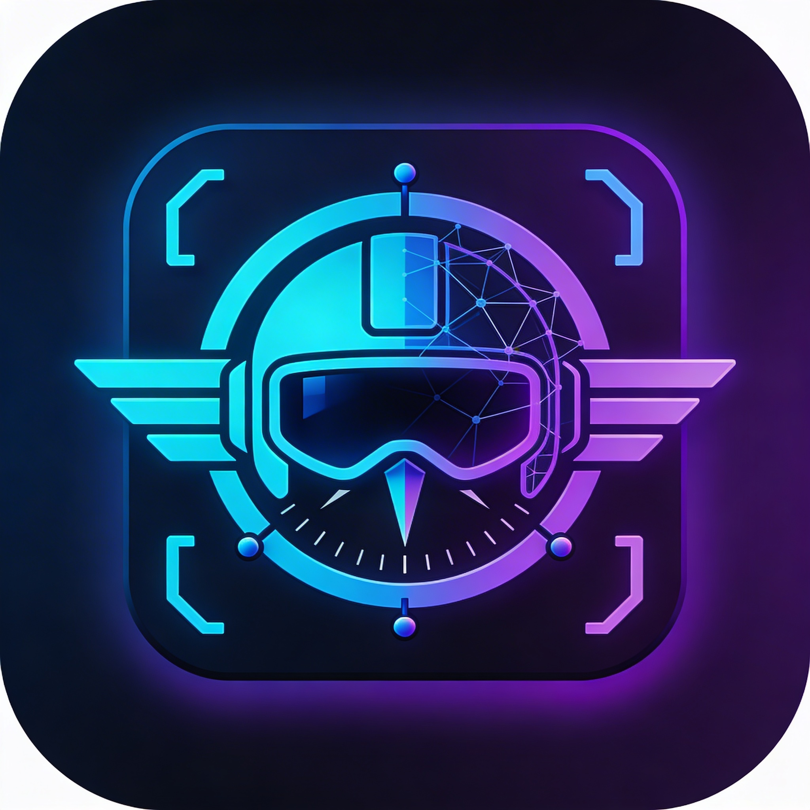

<!-- mcp-name: io.github.inkan-tech/debugpilot -->
<p align="center">
  
</p>

<h1 align="center">DebugPilot</h1>

<p align="center"><strong>Give your AI agent eyes into the debugger.</strong></p>

<p align="center">
  <a href="https://marketplace.visualstudio.com/items?itemName=inkan-link.debugpilot"></a>
  <a href="https://marketplace.visualstudio.com/items?itemName=inkan-link.debugpilot"></a>
  <a href="https://github.com/inkan-tech/DebugPilot/blob/main/LICENSE"></a>
</p>

DebugPilot is a VS Code extension that exposes the Debug Adapter Protocol (DAP) as an MCP server. Any MCP-compatible AI agent — Claude Code, Cursor, Cline, Continue.dev, Aider — can inspect debug state, control execution, and set breakpoints without manual copy-paste.

## Features

### Inspection

- **`debug_sessions`** — list active debug sessions with status and pause reason
- **`debug_state`** — full snapshot: pause location, source context, locals, call stack
- **`debug_variables`** — get/expand variables with configurable depth (up to 5 levels)
- **`debug_evaluate`** — evaluate expressions in a paused frame
- **`debug_console`** — buffered console output with regex filtering and timestamp queries
- **`debug_breakpoints_list`** — list all breakpoints with conditions and hit counts

### Control

- **`debug_continue`** — resume execution
- **`debug_step`** — step over / into / out
- **`debug_pause`** — pause a running session
- **`debug_breakpoint_set`** — set breakpoints with optional conditions and log messages
- **`debug_breakpoint_remove`** — remove breakpoints by ID
- **`debug_exception_config`** — configure exception breakpoints (caught/uncaught)

### Flutter / Dart

- **`debug_hot_reload`** — inject code changes into running Dart VM (preserves app state)
- **`debug_hot_restart`** — full restart with code update (resets app state)

## Quick Start

### Install from Source

```bash
git clone https://github.com/inkan-tech/DebugPilot.git
cd DebugPilot
pnpm install
pnpm run build
```

Then press `F5` in VS Code to launch the Extension Development Host, or package and install:

```bash
pnpm run package
code --install-extension debugpilot-0.5.0.vsix
```

### Connect Your AI Agent

DebugPilot starts an MCP server on `http://127.0.0.1:45853/mcp` using the Streamable HTTP transport.

#### Claude Code (CLI)

```bash
claude mcp add debugpilot --transport http http://127.0.0.1:45853/mcp
```

Or add manually to your project `.mcp.json`:

```json
{
  "mcpServers": {
    "debugpilot": {
      "url": "http://127.0.0.1:45853/mcp"
    }
  }
}
```

#### Cursor

Add a `.cursor/mcp.json` to your project root (see [`examples/mcp-cursor.json`](examples/mcp-cursor.json)):

```json
{ "mcpServers": { "debugpilot": { "url": "http://127.0.0.1:45853/mcp" } } }
```

#### Other MCP clients

Point to the same URL. Any client supporting MCP Streamable HTTP will work.

#### Claude Code Skill (optional)

Install the `/debugpilot` skill to give Claude Code workflow knowledge for using the debug tools effectively:

```bash
cp -r skills/debugpilot ~/.claude/skills/debugpilot
```

Then use `/debugpilot` in any Claude Code session to activate the debug workflow.

## Usage Examples

### Inspect a paused session

```
Agent: What's the current debug state?
→ calls debug_sessions → finds session paused on exception
→ calls debug_state → sees location, locals, call stack
→ calls debug_console → reads recent error output
→ "The TypeError at line 42 is caused by `user` being undefined..."
```

### Step through code

```
Agent: Step through the next 3 lines and show me what changes
→ calls debug_step(type: "over") × 3
→ calls debug_variables after each step
→ "After line 44, `result` changed from null to {status: 'ok'}..."
```

### Set a conditional breakpoint

```
Agent: Break when userId equals "admin"
→ calls debug_breakpoint_set(file: "auth.ts", line: 15, condition: 'userId === "admin"')
→ calls debug_continue
```

### Flutter hot reload

```
Agent: I changed the widget, hot reload please
→ calls debug_hot_reload(sessionId: "abc123")
→ "Hot reload complete — UI updated with your changes, app state preserved"
```

## Architecture

```
┌─────────────┐   MCP (Streamable HTTP)  ┌──────────────────┐
│  AI Agent   │ ◄──────────────────────► │  MCP Server      │
│ (Claude Code│                          │  (in extension)  │
│  Cursor etc)│                          └────────┬─────────┘
└─────────────┘                                   │
                                                  │ vscode.debug API
                                                  ▼
                                          ┌───────────────┐
                                          │ VS Code Debug  │
                                          │ Adapter (DAP)  │
                                          │ Node/Bun/LLDB/ │
                                          │ Python/Go/...  │
                                          └───────────────┘
```

The MCP server runs inside the VS Code extension host process — no child processes or IPC. It proxies MCP tool calls to `vscode.debug.*` APIs.

## Supported Runtimes

DebugPilot works with any VS Code debug adapter:

| Runtime | Debug Adapter | Status |
|---------|---------------|--------|
| Node.js | `pwa-node` | Tested |
| Bun | `bun` | Tested |
| Flutter/Dart | `dart` | Supported (hot reload/restart) |
| Python | `debugpy` | Planned |
| Go | `dlv` | Planned |
| Rust/C++ | `lldb` / `codelldb` | Planned |
| Java | `java` | Planned |

## Configuration

VS Code settings under `debugPilot.*`:

| Setting | Default | Description |
|---------|---------|-------------|
| `debugPilot.enabled` | `true` | Enable/disable the MCP server |
| `debugPilot.startMode` | `"lazy"` | `"lazy"` — start on first debug session or manual trigger; `"auto"` — start immediately on VS Code open |
| `debugPilot.consoleBufferSize` | `10000` | Max console messages to buffer per session |
| `debugPilot.variableDepthLimit` | `1` | Default depth for variable expansion |
| `debugPilot.sourceContextLines` | `10` | Lines of source shown above/below current position |

### Start Modes

**Lazy (default):** The MCP server does not start until you either start a debug session or click the status bar item. This avoids occupying a port and consuming resources when you're not debugging. The status bar shows "DebugPilot (waiting)" until the server starts.

**Auto:** The MCP server starts immediately when VS Code opens (previous behavior). Use this if your AI agent needs to connect before you start debugging.

### Commands

- **DebugPilot: Start MCP Server** — manually start the server (useful in lazy mode)
- **DebugPilot: Stop MCP Server** — stop the server and free the port
- **DebugPilot: Restart MCP Server** — restart without reloading the window
- **DebugPilot: Show Status** — display active sessions and server URL

## Endpoints

| Path | Method | Description |
|------|--------|-------------|
| `/mcp` | POST/GET/DELETE | MCP Streamable HTTP transport |
| `/health` | GET | Health check — returns `{"status": "ok"}` |
| `/shutdown` | POST | Graceful shutdown (used for port reclaim) |

## Development

```bash
pnpm install              # Install dependencies
pnpm run build            # Build with esbuild → dist/extension.js
pnpm run build:watch      # Watch mode
pnpm run build:check      # Type check (tsc --noEmit)
pnpm run test             # Run tests (vitest)
```

### Project Structure

```
src/
├── extension.ts          # VS Code activate/deactivate
├── server.ts             # MCP server + HTTP transport
├── debug-adapter.ts      # IDebugAdapter → vscode.debug.* bridge
├── session-manager.ts    # Debug session lifecycle + console buffers
├── console-buffer.ts     # Ring buffer for console output
├── source-reader.ts      # Read source lines around breakpoints
├── types.ts              # IDebugAdapter interface + shared types
├── constants.ts          # Tool names, defaults
└── tools/                # One file per MCP tool
    ├── index.ts
    ├── debug-sessions.ts
    ├── debug-state.ts
    ├── debug-variables.ts
    ├── debug-evaluate.ts
    ├── debug-console.ts
    ├── debug-breakpoints-list.ts
    ├── debug-breakpoint-set.ts
    ├── debug-breakpoint-remove.ts
    ├── debug-continue.ts
    ├── debug-step.ts
    ├── debug-pause.ts
    └── debug-exception-config.ts
```

## Security

- Server listens on `127.0.0.1` only — no remote access
- No authentication required for local connections
- `debug_evaluate` runs expressions in the debuggee's context (same security model as VS Code's Debug Console)
- Port reclaim only works against other DebugPilot instances (verified via `/health`)

## Roadmap

- [x] MCP resources with subscriptions (live console stream, breakpoint events)
- [x] Pre-built prompts (`debug_investigate`, `debug_trace`)
- [x] Event notifications (breakpoint hit, exception, session lifecycle)
- [x] Graceful error handling (actionable messages for missing sessions)
- [ ] Submit to MCP server registry

## License

Apache 2.0 — see [LICENSE](LICENSE).
